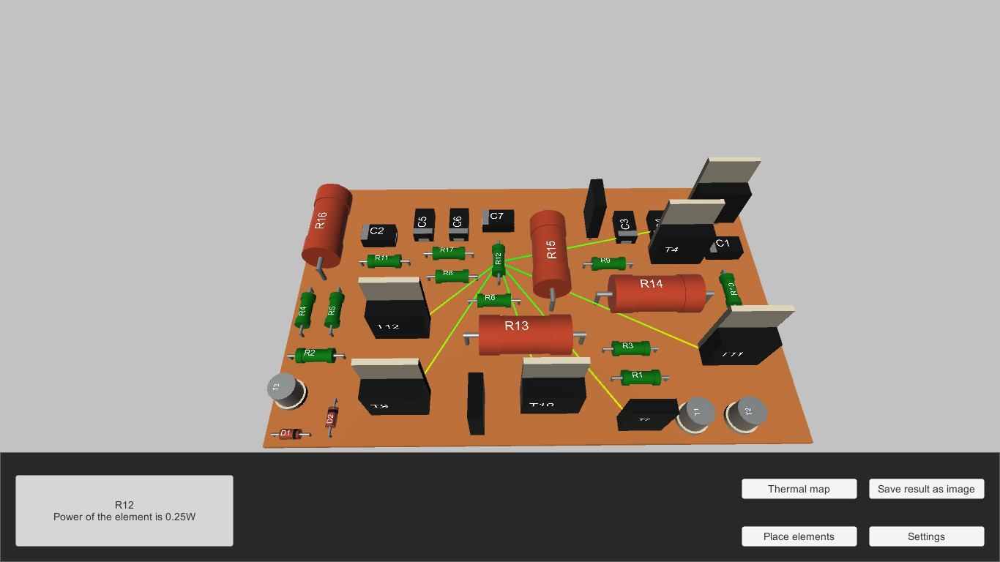

# Automated placement of constructive elements on PCB

The program was developed in 2016 using Unity3d and C# as a bachelor project. It uses genetic algorithm to place elements on a PCB.

There are two criteria to place elements: power dissipation (the heat dissipation of the elements should not damage nearby elements) and the total length of interconnections (should be as small as possible).

## Program screenshot

